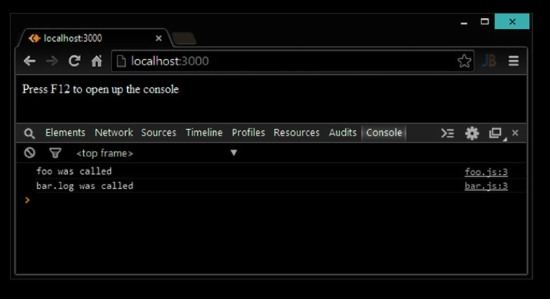

## Introducing AMD

Como comentamos al principio de este capítulo, Node.js sigue la especificación del módulo CommonJS. Este modulo
El sistema es excelente para el entorno del servidor cuando tenemos acceso inmediato al sistema de archivos. Hablamos de eso
cargar un módulo del sistema de archivos en Node.js es una llamada de bloqueo por primera vez. Considere el caso simple de
cargando dos módulos, como se muestra en el Listado 3-45

Listado 3-45. Fragmento de código para mostrar la carga de dos módulos usando CommonJS

```
var foo = require('./foo');
var bar = require('./bar');
// continue code here
```

En este ejemplo, bar.js no se analiza hasta que se haya cargado todo foo.js. De hecho, Node.js ni siquiera sabe que
necesitará bar.js hasta que se cargue foo.js y se analice la línea requerida ('./ bar'). Este comportamiento es aceptable en
un entorno de servidor donde se considera parte del proceso de arranque para su aplicación. En su mayoría requiere
Las cosas al iniciar su servidor y luego se devuelven de la memoria.

Sin embargo, si se utiliza el mismo sistema de módulos en el navegador, cada declaración de requerimiento deberá activar
Una solicitud HTTP al servidor. Este es un orden de magnitud más lento y 
menos confiable que una llamada de acceso al sistema de archivos.
Cargar una gran cantidad de módulos puede degradar rápidamente 
la experiencia del usuario en el navegador. La solución es asíncrona,
En paralelo, y carga frontal de módulos. Para soportar esta carga asíncrona, 
necesitamos una manera de declarar que este archivo
dependa de ./foo y ./bar por adelantado y continúe con la ejecución del código usando una devolución de llamada. 
Ya hay una especificación
para exactamente esto se llama definición de módulo asíncrono (AMD). Se muestra el mismo ejemplo del Listado 3-45 en formato AMD.
en el Listado 3-46.

Listado 3-46. Fragmento de código para mostrar la carga de dos módulos usando AMD

```
define(['./foo', './bar'], function(foo, bar){
    // continue code here
});
```

La función de define no es nativa del navegador. Estos deben ser proporcionados por una biblioteca de terceros. Lo mas
El popular de estos para el navegador es RequireJS (http://requirejs.org/).

Para reiterar, el navegador tiene diferentes requisitos de latencia desde el inicio de un servidor. Esto requiere una diferente
Sintaxis para cargar módulos de forma asíncrona. La diferente naturaleza de la 
llamada requerida es lo que hace que se reutilice Node.js
Código en el navegador un poco más complicado. Antes de profundizar, configuremos una aplicación de arranque RequireJS.

Listing 3-50. amd/play/client/app.js
```
define(['./foo', './bar'], function (foo, bar) {
// use foo and bar here
});
```


define puede tomar un argumento especial llamado exportaciones, que se comporta 
de manera similar a la variable de exportaciones en Node.js.
Creemos el módulo bar.js usando esta sintaxis, como se muestra en el Listado 3-51.

Listing 3-51. amd/play/client/bar.js

```
define(['exports'], function (exports) {
    var bar = exports.log = function () {
    console.log('bar.log was called');
    };
});
```

Tenga en cuenta que solo puede usar las exportaciones para adjuntar las 
variables que desea exportar (por ejemplo, exports.log =
/ * algo * /), pero no puede asignarlo a otra cosa (exportaciones = / * algo * /) ya que eso rompería el
referencia la variable de exportaciones monitoreada por RequireJS. 
Conceptualmente es bastante similar a la variable de exportaciones en
Node.js. Ahora, completemos app.js y consumamos ambos módulos, como se muestra en el Listado 3-52.

Listing 3-52. amd/play/client/app.js

```
define(['./foo', './bar'], function (foo, bar) {
    foo();
    bar.log();
});
```

Si ejecuta esta aplicación, obtendrá el resultado deseado que se muestra en la Figura 3-2.



