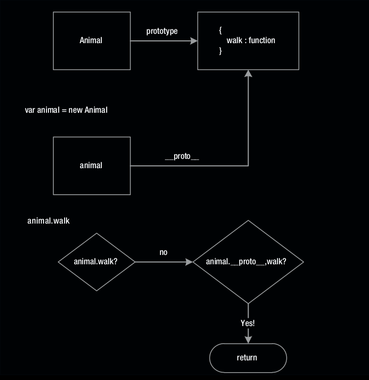

## Arriving at an Inheritance Pattern

Vamos a crear una clase de animales. Tiene una función miembro 
simple llamada caminar. Ya hemos discutido que este '
dentro de una función se refiere al objeto recién creado cuando 
se llama a una función con el operador new (por ejemplo,
`nuevo animal). También discutimos que el miembro prototipo 
de la función constructor (Animal.prototype) es
referenciado por el objeto prototipo (animal .__ proto__) 
debido al uso del nuevo operador. (Ver Listado 5-1).

Listing 5-1. oo/1animal.js

```
function Animal(name) {
    this.name = name;
}

Animal.prototype.walk = function (destination) {
    console.log(this.name, 'is walking to', destination);
}

var animal = new Animal('elephant');
animal.walk('melbourne');
```

Para comprender mejor cómo se realiza la búsqueda en animal.walk, 
eche un vistazo al diagrama en la Figura 5-1.




Figura 5-1. Ejemplo de búsqueda de miembro del prototipo

Ahora heredemos toda la funcionalidad de la clase Animal en una nueva
clase, por ejemplo, Bird. Para hacer esto, tenemos que hacer
dos cosas:

* Llamar al constructor de animales desde el constructor de aves.
Esto asegura que las propiedades están establecidas.
correctamente para el objeto Bird (Animal.name en nuestro ejemplo).
* Encuentre una manera de hacer que todos los miembros prototipos de
los padres (animales) (por ejemplo, __proto __. Caminar) una
miembro del prototipo del prototipo de la instancia child (Bird).
Esto permitirá instancias de aves.
(por ejemplo, bird) para tener sus propias funciones en su
propio prototipo (bird.__proto__.fly)
y los miembros padres en el prototipo de su prototipo
(bird .__ proto __.__ proto __. walk).
Esto se llama configurar una cadena prototipo.

Comenzaremos por desarrollar la clase de aves. Basado en el algoritmo,
se verá como el código en el Listado 5-2.

Listing 5-2. Building Up to Inheritance

```
function Bird(name){
    // Call the Animal constructor
}
// Setup the prototype chain between Bird and Animal
// Finally create child instance
var bird = new Bird('sparrow');
```


