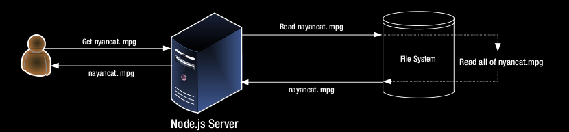
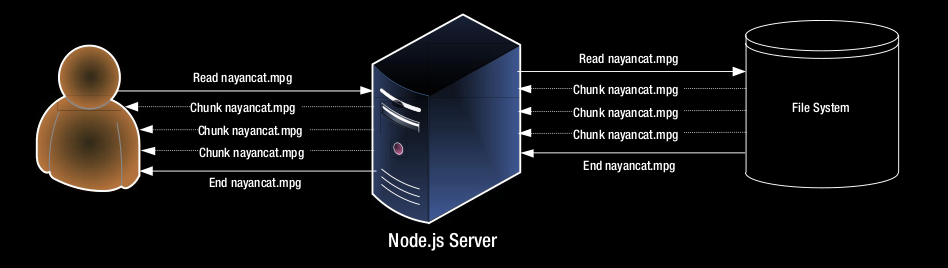

## Streams

Las transmisiones juegan un papel importante en la creación de aplicaciones 
web de alto rendimiento. Para entender lo que las corrientes traen a la
En la tabla, considere el caso simple de servir un archivo grande 
(1 GB) desde un servidor web. En ausencia de arroyos, se vería
como la figura 5-3. El usuario tendría que esperar mucho tiempo antes 
de obtener cualquier signo del archivo que solicitó.

Esto se denomina almacenamiento en búfer, y deberíamos intentar 
limitarlo tanto como sea posible. Además de la obvia mala experiencia de usuario,
También desperdicia recursos. El archivo completo debe cargarse y 
guardarse en la memoria antes de comenzar a enviarlo a
el usuario.



Figure 5-3. Buffered web response

The same scenario looks much better when we use streaming. We start 
reading the file and whenever we have a
new chunk of data, we send it down to the client until we reach the end, 
as shown in Figure 5-4.



Figure 5-4. Streaming web response

Esta mejora en la experiencia del usuario y una mejor utilización 
de los recursos del servidor es la principal motivación detrás de
los steams

Los conceptos más importantes son el de flujos legibles, flujos grabables, flujos dúplex y transformación.
arroyos Una secuencia legible es aquella en la que puede leer datos pero no 
escribir. Un buen ejemplo de esto es el proceso.
stdin, que se puede utilizar para transmitir datos desde la entrada estándar. 
Una secuencia de escritura es una que puede escribir pero
no leer de Un buen ejemplo es process.stdout, que se puede usar para 
transmitir datos a la salida estándar. Un duplex
stream es uno que puede leer y escribir. Un buen 
ejemplo de esto es el socket de red. Puedes escribir
datos al zócalo de la red, así como leer los datos de él. 
Un flujo de transformación es un caso especial de un flujo dúplex donde
la salida del flujo se calcula de alguna manera a 
partir de la entrada. Estos también son llamados a través de corrientes. Un bien
ejemplo de esto es el cifrado y las secuencias de compresión.

Todos los bloques de construcción básicos de flujos están presentes 
en el módulo de flujo de núcleo de Node.js que carga usando
require('stream'). Hay clases básicas para implementar secuencias 
presentes en este módulo, llamadas apropiadamente como legibles,
Se puede escribir, duplex y transformar.

Las transmisiones en Node.js se basan en eventos, 
por lo que fue importante tener una comprensión sólida de los eventos
Antes de que pudiéramos sumergirnos en arroyos. 
Todas estas clases de flujo heredan de una clase de flujo abstracta abstracta (resumen
porque no debería usarlo directamente), que a su vez hereda de EventEmitter (que vimos anteriormente).
Esta jerarquía se demuestra en el Listado 5-35.

Listing 5-35. streams/1concepts/eventBased.js

```
var stream = require("stream");
var EventEmitter = require("events").EventEmitter;

console.log(new stream.Stream() instanceof EventEmitter );

console.log(new stream.Readable({}) instanceof stream.Stream);// true
console.log(new stream.Writable({}) instanceof stream.Stream);// true
console.log(new stream.Duplex({}) instanceof stream.Stream); // true
console.log(new stream.Transform({}) instanceof stream.Stream); // true
```

Antes de ver cómo podemos crear nuestras propias transmisiones, 
veamos cómo podemos consumir las transmisiones existentes.
en la biblioteca Node.js


