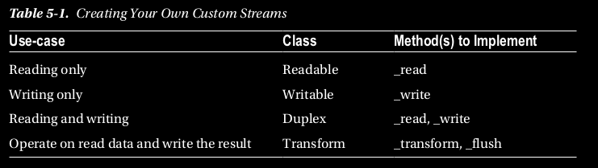

## Creating Your Own Stream

Crear tu propia transmisión es muy similar a cómo creas tu propio EventEmitter. 
Para las corrientes que heredas de la
Base relevante, clase de flujo e implementar algunos métodos de base. 
Esto se detalla en la Tabla 5-1.

El mecanismo de herencia es el mismo que hemos visto antes. 
Es decir, llamas al constructor base desde tu
el constructor de la clase y llama a utils.inherits después de declararte clase.