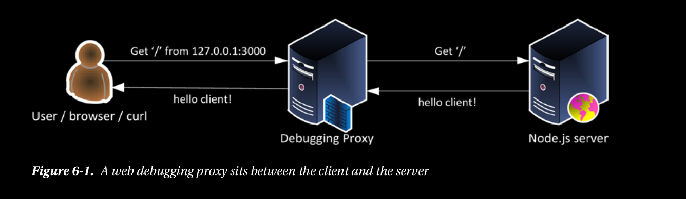
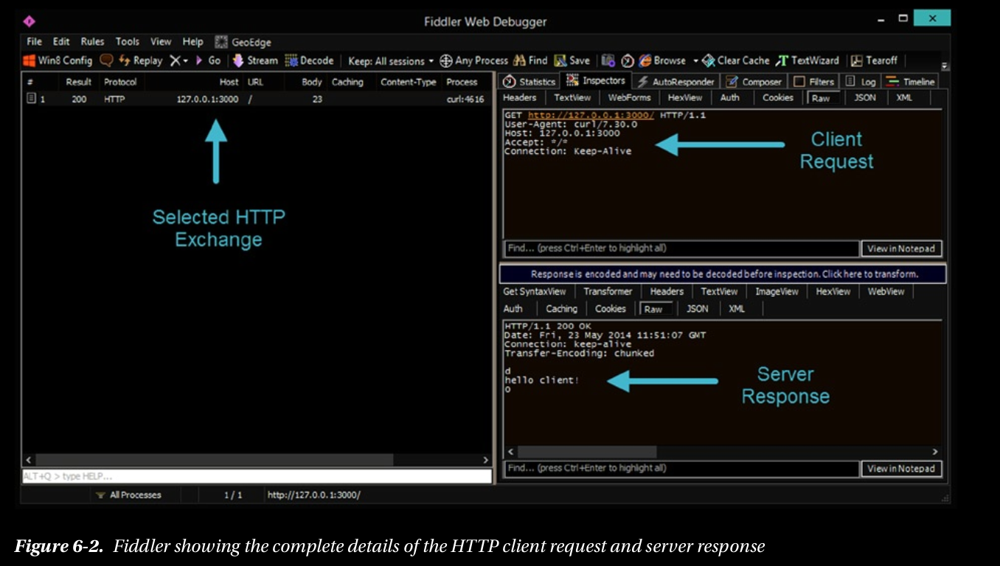

## Using a Debugging Proxy

Una excelente herramienta que puede usar para ayudarlo a explorar y experimentar con 
HTTP es un proxy de depuración web. Un proxy de depuración es un
aplicación que se encuentra entre el cliente y el servidor, y registra 
todas las solicitudes y respuestas intercambiadas entre
los dos. En la Figura 6-1 se muestra una breve descripción 
de cómo se llevará a cabo este intercambio.



Un proxy de depuración muy popular y gratuito que 
está disponible para Windows y Mac OS X es Fiddler
(www.telerik.com/fiddler), que tiene un instalador 
simple con un solo clic. (Nota: en Mac OS X, necesitará instalar
mono www.mono-project.com/download/ antes de que pueda 
instalar fiddler). Una vez que inicie el violinista, escuchará en el puerto 8888.
por defecto. Debe indicar a la aplicación cliente que 
use un proxy para conectarse al servidor. Para curl, puedes hacer eso.
usando la opción -x (usa el proxy). Iniciar el servidor 
simple que acabamos de crear y lanzar fiddler. A continuación, ejecute el siguiente
comando (Listado 6-7) para hacer una solicitud de cliente usando fiddler como un proxy.

Listing 6-7. Making a curl Request Specifying a Proxy Server

```
$ curl http://127.0.0.1:3000 -x 127.0.0.1:8888
hello client!
```


Dado que fiddler se está ejecutando, capturará la solicitud y la 
respuesta. Como se puede ver en la Figura 6-2,
Los datos reales enviados desde el servidor 
en la respuesta del servidor están ligeramente 
codificados, como se muestra nuevamente en el Listado 6-8.



Listing 6-8. The Server Response Message Body

```
d
hello client!
0
```

Esta codificación se debe a que, de forma predeterminada, Node.js intenta 
transmitir la respuesta al cliente. Usted ve que la transferencia-
El encabezado de respuesta del servidor de codificación está configurado 
como fragmentado. La codificación de transferencia fragmentada es un 
mecanismo de transferencia de datos de
Protocolo HTTP que le permite enviar datos usando fragmentos (también conocido como transmisión). 
En transferencias fragmentadas, la
El tamaño de la transferencia (en hexadecimal) se envía justo antes del 
fragmento en sí mismo para que el receptor pueda saber cuándo ha terminado 
de recibir los datos para ese pedazo. Node.js envió d (decimal 13) 
porque esa es la longitud de "hola cliente". los
la transferencia se termina enviando un fragmento de longitud 0 
(de ahí el 0 final). Todo esto fue atendido por usted por el
Servidor HTTP Node.js incorporado.
