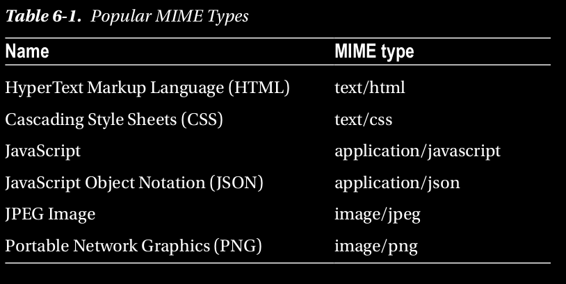

## Setting Headers

Puede poner en cola explícitamente cualquier encabezado HTTP en la respuesta usando 
el miembro response.setHeader (nombre, valor)
función. Un encabezado común que debe establecer es el tipo de contenido de 
la respuesta para que el cliente sepa cómo hacerlo.
Para interpretar los datos que el servidor envía en el cuerpo. 
Por ejemplo, si está enviando un archivo HTML al cliente,
debe establecer el Tipo de contenido en texto / html, 
que puede hacer con el siguiente código:

```
response.setHeader("Content-Type", "text/html");
```

El término formal para el valor del encabezado Content-Type es tipo MIME. 
Tipos MIME para algunos tipos de contenido clave
se muestran en la Tabla 6-1.



Para este y muchos más tipos MIME, hay un paquete NPM simple 
llamado mime (npm install mime), que
se puede usar para obtener el tipo mime oficial de una 
extensión de archivo. El listado 6-9 muestra cómo puedes usarlo.

Listing 6-9. Demonstration of Using the MIME NPM Package

```
var mime = require('mime'); // => 'text/plain'
mime.lookup('/path/to/file.txt'); // => 'text/plain'
mime.lookup('file.txt'); // => 'text/plain'
mime.lookup('.TXT'); // => 'text/plain'
mime.lookup('htm'); // => 'text/html'
```

Volviendo a nuestra discusión de encabezados, puede obtener un encabezado que 
está en cola para ser enviado usando el
función response.getHeader:

```
var contentType = response.getHeader('content-type');
```

Puede eliminar un encabezado de la cola mediante la función response.removeHeader:

```
response.removeHeader('Content-Encoding');
```


