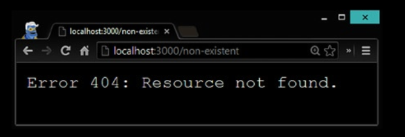

## Serving Base HTML

Ahora que tenemos una comprensión más profunda de la secuencia de 
respuesta y los tipos MIME, podemos crear un servidor web simple
que devuelve archivos HTML de una carpeta. Cree un archivo 
HTML simple, llamado index.html, que planeamos devolver en cada
solicite GET ‘/’ en el servidor, como se muestra en el Listado 6-11.

```
<html>
<head>
<title>Hello there</title>
</head>
<body>
You are looking lovely!
</body>
</html>
```

Para empezar, vamos a crear algunas funciones de utilidad. Siempre es 
mejor dividir la funcionalidad en separada
Funciones en lugar de un bloque monolítico de código. Si recibimos 
una solicitud de una url que no aceptamos, deberíamos
devuelve una respuesta HTTP 404 (No encontrado). El listado 6-12 
proporciona una función que hace exactamente eso.

Listing 6-12. A Utility Function to Return 404 Not Found HTTP Response

```
function send404(response) {
    response.writeHead(404, { 'Content-Type': 'text/plain' });
    response.write('Error 404: Resource not found.');
    response.end();
}
```

Si podemos satisfacer la solicitud, deberíamos devolver HTTP 200 
junto con un tipo MIME para el contenido. Devolviendo el
El archivo HTML es tan simple como crear un flujo de archivo de 
lectura y canalizarlo a la respuesta. Listado 6-13 muestra el completo
código del servidor

Listing 6-13. Code from 2server/server.js
```
const http = require("http");
const fs = require("fs");

function send404(response) {
    response.writeHead(404, {"Content-Type": "text/pain"});
    response.write("Error 404: resource not found");
    response.end();
}

let server = http.createServer(function (req, res) {
    if (req.method == "GET" && req.url == '/') {
        res.writeHead(200, {'content-type': 'text/html'});
        fs.createReadStream("./public/index.html").pipe(res);
    } else {
        send404(res);
    }
}).listen(3001);
console.log('server running on port 3001');
```

Si inicia el servidor (ejecute node server.js del 
directorio chapter6 / 2server) y abra su navegador en
http: // localhost: 3000, verá la página HTML 
que creamos anteriormente (Figura 6-3).


De manera similar, si visita cualquier otra URL en localhost, recibirá un mensaje de error 404 (Figura 6-4).




