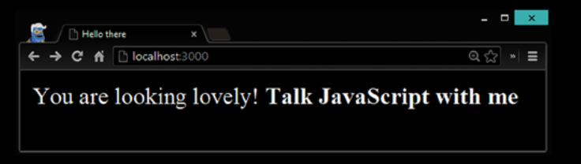

## Serving a Directory

Es un buen comienzo para un servidor de archivos estáticos manuscritos. Sin embargo, 
solo sirve un archivo. Vamos a abrirlo un poco para
Servir todos los contenidos de un directorio. En primer lugar, cree un 
simple archivo JavaScript del lado del cliente que se agregue al cuerpo después de
La carga de HTML está completa, como se muestra en el Listado 6-14. 
Planeamos solicitar este archivo JavaScript desde el servidor.

Listing 6-14. Code from 3serverjs/public/main.js

```
window.onload = function () {
    document.body.innerHTML += `<strong> Talk Javascript with me</strong>`
}
```

Modifiquemos nuestro simple archivo HTML agregando una etiqueta de 
script en <head> para cargar un archivo JavaScript del lado del cliente.

Ahora, si ejecutamos el mismo servidor antiguo, obtendremos un 404 
cuando nuestro navegador analiza index.html e intenta cargar
main.js desde el servidor. Para soportar esta carga de JavaScript, 
necesitamos hacer lo siguiente:

* use el módulo de ruta para resolver la ruta al archivo en el sistema 
de archivos basado en request.url
propiedad
* ver si tenemos un tipo MIME registrado para el tipo de archivo solicitado
* asegúrese de que el archivo existe antes de intentar leerlo desde el sistema de archivos.

Listing 6-15. Code from 3serverjs/server.js
```

var http = require('http');
var fs = require('fs');
var path = require('path');
function send404(response) {
    response.writeHead(404, { 'Content-Type': 'text/plain' });
    response.write('Error 404: Resource not found.');
    response.end();
}
var mimeLookup = {
    '.js': 'application/javascript',
    '.html': 'text/html'
};
var server = http.createServer(function (req, res) {
    if (req.method == 'GET') {
        // resolve file path to filesystem path
        var fileurl;
        if (req.url == '/') fileurl = '/index.html';
        else fileurl = req.url;
        var filepath = path.resolve('./public' + fileurl);
        // lookup mime type
        var fileExt = path.extname(filepath);
        var mimeType = mimeLookup[fileExt];
            if (!mimeType) {
                send404(res);
                return;
            }
        // see if we have that file
        fs.exists(filepath, function (exists) {
            // if not
            if (!exists) {
                send404(res);
                return;
            };
            // finally stream the file
            res.writeHead(200, { 'content-type': mimeType });
            fs.createReadStream(filepath).pipe(res);
        });
    }
    else {
        send404(res);
    }
}).listen(3000);
console.log('server running on port 3000');
```

La mayor parte del código en el ejemplo se explica por sí mismo y se resaltan 
las secciones interesantes. Si abres
El navegador ahora y visite localhost: 3000, verá que se 
solicitó el HTML y que se cargó el JavaScript.
y corrió con éxito (Figura 6-5).



Figure 6-5. Browser showing the client JavaScript was successfully requested and rendered.

Todavía faltan muchas características en nuestra implementación actual. 
Por un lado, no es seguro contra un
URL maliciosa. Por ejemplo, puede explotar el hecho de que hay 
una ruta simple. Resuelva en nuestra implementación para
solicite cualquier archivo del sistema de archivos del servidor, 
como se muestra en el Listado 6-16 (aquí solicitamos el código del servidor)
desde el servidor).

Listing 6-16. Demonstrating a File System Listing Vulnerability in Our Simple File Server

```
$ curl 127.0.0.1:3000/../server.js
var http = require('http');
var fs = require('fs');
var path = require('path');
...truncated... the rest of server.js
```

Luego está el manejo de errores y el almacenamiento en caché de archivos, 
ambos faltan en nuestra implementación. Teniendo el
el conocimiento para construir su propio servidor web Node.js desde cero es 
invaluable, pero no tiene que construir un servidor web
desde cero La comunidad ya lo ha hecho por usted y exploraremos esas opciones más adelante.


